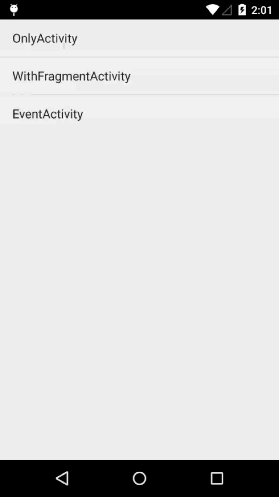

# LeapCloud-Demo-Analytics-Android

## Overview

Analytics is a sample of LeapCloud SDK, and it relies on the basic module of LeapCloud. This app shows the data analytics operation based on LeapCloud SDK.

There are 3 pages in this project:
- *OnlyActivity*
	- Introduce how to calculate the Session Length and Page View of a general Activity.
- *WithFragmentActivity*
	- Introduce how to calculate the Session Length and Page View of an Activity with Fragment.
- *EventActivity*
	- Introduce how to calculate customized events.

## Effect

## How to Use

1. Open Android Studio or IDEA, click `File -> Open `, select and import `setting.gradle`.
2. Open `App.java` and replace the defined constants with your own `APP Id` and `API KEY`.
