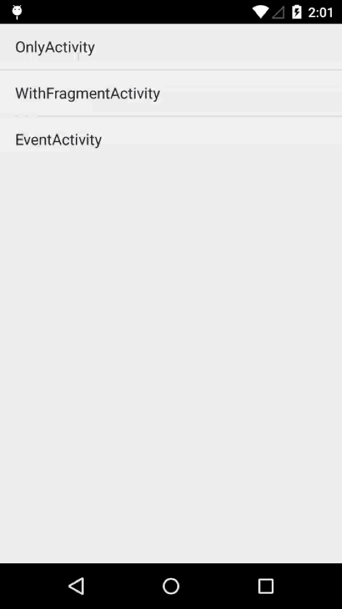

# LeapCloud-Demo-Analytics-Android

## 简介

Analytics 是 LeapCloud SDK 的一个 Sample，该项目依赖于 LeapCloud 的基础模块。通过该应用你可以学习和了解基于 LeapCloud SDK 的数据分析操作。

整个项目一共分为以下三个画面
- *OnlyActivity*
	- 介绍了如何在普通的 Activity 中统计 Session 时长和 Page View。
- *WithFragmentActivity*
	- 介绍了如何在含有 Fragment 的 Activity 中统计 Session时长 和 Page View。
- *EventActivity*
	- 介绍了如何统计自定义事件。

## 效果

## 使用

1. 打开 Android Studio 或 IDEA ，点击菜单项 `File -> Open ` 选择 `setting.gradle` 文件导入工程
2. 打开 `App.java` 文件，使用你自己的 `APP Id` 和 `API KEY` 替换该文件中已定义的同名常量。
